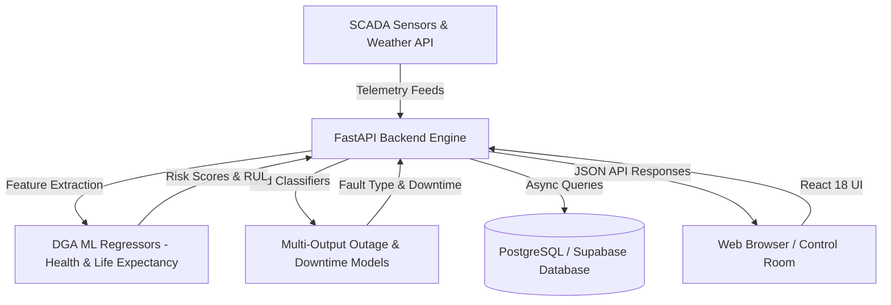

# Architecture

## System Architecture

## Components

| Component | Technology | Responsibility |
|---|---|---|
| Frontend UI | React 18, Vite, Lucide Icons, Vanilla CSS | Real-time monitoring dashboard, interactive risk assessment forms, telemetry charts, crew planning |
| Backend API | FastAPI, Python 3.11+, Pydantic | REST API endpoints, CORS handling, data validation, orchestration |
| ML Inference Engine | Scikit-Learn, Pandas, NumPy, Joblib | DGA Gradient Boosting regressor, Random Forest classifiers, Downtime regressor |
| Database Layer | PostgreSQL, Supabase | Telemetry storage, asset registries, historical incident logs, crew records |
| Security & Multi-Tenancy | Row-Level Security (RLS), JWT | Company-isolated data scoping and role-based access control |

## Data Flow

1. Real-time sensor readings and meteorological feeds are sent to the FastAPI backend.
2. The `feature_processing` module normalizes telemetry and computes multi-variable feature vectors.
3. The `ml_prediction_engine` loads serialized `.joblib` pipelines and executes low-latency inference.
4. The `prediction_service` combines ML outputs with IEEE engineering threshold rules to generate health scores, life expectancy, fault type predictions, and maintenance actions.
5. The React dashboard updates live telemetry cards, risk badges, and alert notifications.

## Security Considerations

- Environment variables (`.env`) are strictly separated and git-ignored.
- Multi-company data isolation enforced at the database level.
- Input validation on all diagnostic and simulation endpoints via Pydantic schemas.
